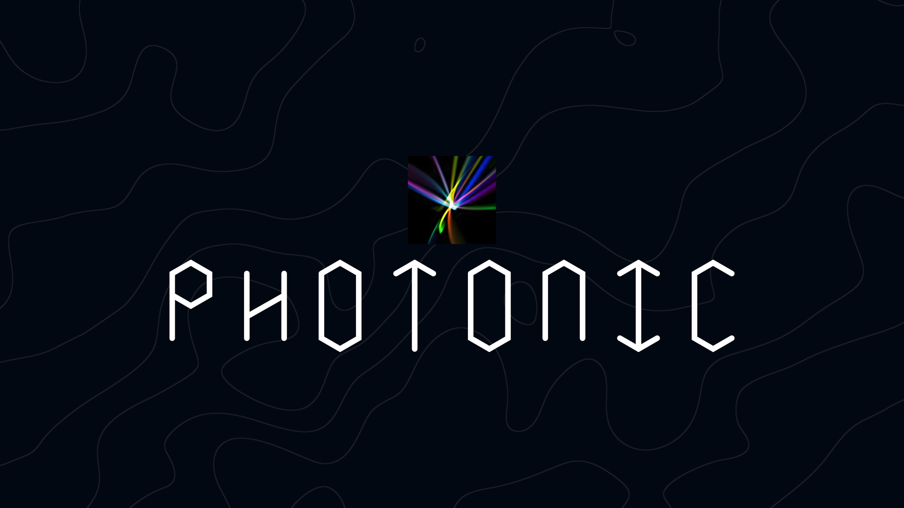

# Photonic

Photonic website: making cool things.

The spark for creating Photonic was born 2024, when I suddenly had inspiration to update [Overwrite](https://github.com/PhotonicGluon/Overwrite) to look cooler and more modern. It was only in December that I decided to embark on the long process of modernising the portfolio site — to use modern web frameworks like [Astro](https://astro.build/) and CSS frameworks like [TailwindCSS](https://tailwindcss.com/) to design a site that can truly last for years.

## Setup

Development of the website primarily occurs in a devcontainer.

If you already have Visual Studio Code and Docker installed, you can click the badge above or [here](https://vscode.dev/redirect?url=vscode://ms-vscode-remote.remote-containers/cloneInVolume?url=https://github.com/PhotonicGluon/Photonic) to get started. Clicking these links will cause VS Code to automatically install the Dev Containers extension if needed, clone the source code into a container volume, and spin up a dev container for use. Follow [this guide](https://code.visualstudio.com/docs/devcontainers/tutorial) for more details.

> [!IMPORTANT]
> If you are setting up the devcontainer on a Windows machine, it is recommended to clone this project into WSL. Otherwise, file watching would not work as intended.

## License

The source code is released under the [MIT License](LICENSE).

The blog posts' assets (including but not limited to the textual content, images, source codes, etc.) are released under the [Creative Commons Attribution 4.0 International License](LICENSE-BLOG), unless otherwise specified.

All other content are released under the same license as the source code.
