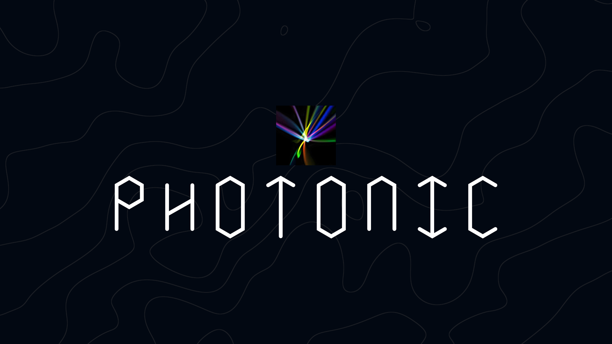

# Photonic



Photonic website: making cool things.

The spark for creating Photonic was born 2024, when I suddenly had inspiration to update [Overwrite](https://github.com/PhotonicGluon/Overwrite) to look cooler and more modern. It was only in December that I decided to embark on the long process of modernising the portfolio site — to use modern web frameworks like [Astro](https://astro.build/) and CSS frameworks like [TailwindCSS](https://tailwindcss.com/) to design a site that can truly last for years.

## Setup

> [!IMPORTANT]
> If you are setting up the project on a Windows machine, it is recommended to clone this project into WSL. Otherwise, file watching would not work as intended.

Development of the website primarily uses [`pnpm`](https://pnpm.io/).

After opening the `Photonic.code-workspace` in an IDE of your choice, install the dependencies using:
```bash
pnpm i
```

> [!NOTE]
> It is recommended to disable Astro telemetry using:
> ```bash
> pnpm run astro telemetry disable
> ```

To start the development server, run:
```bash
pnpm run dev
```

## License

The source code is released under the [MIT License](LICENSE).

The blog posts' assets (including but not limited to the textual content, images, source codes, etc.) are released under the [Creative Commons Attribution 4.0 International License](LICENSE-BLOG), unless otherwise specified.

All other content are released under the same license as the source code.
