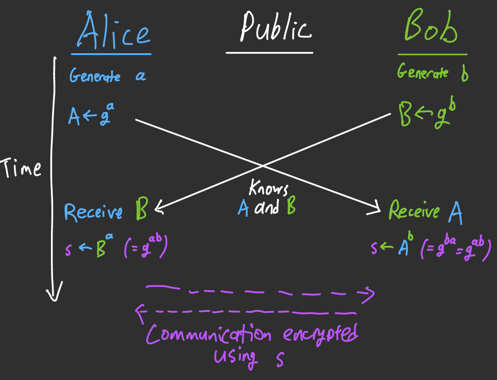
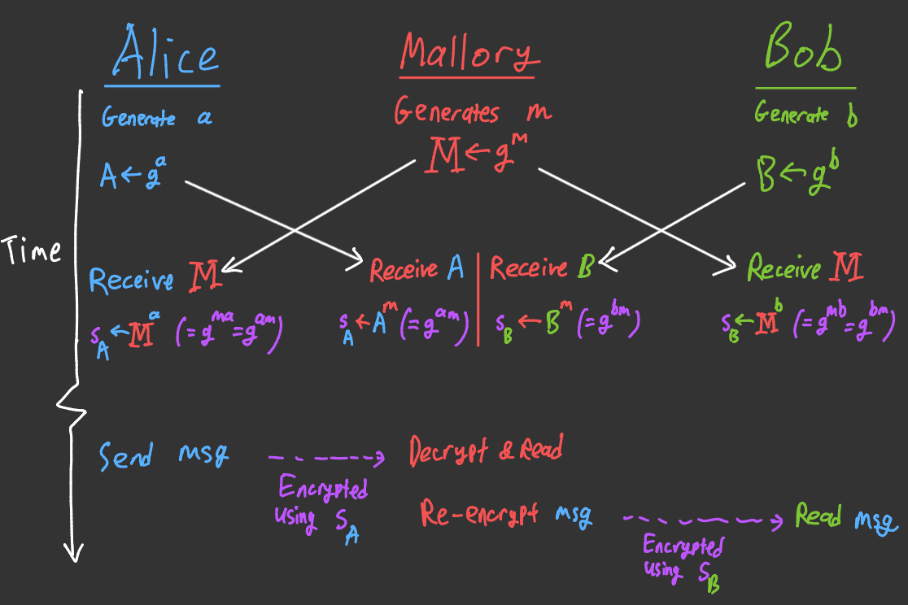
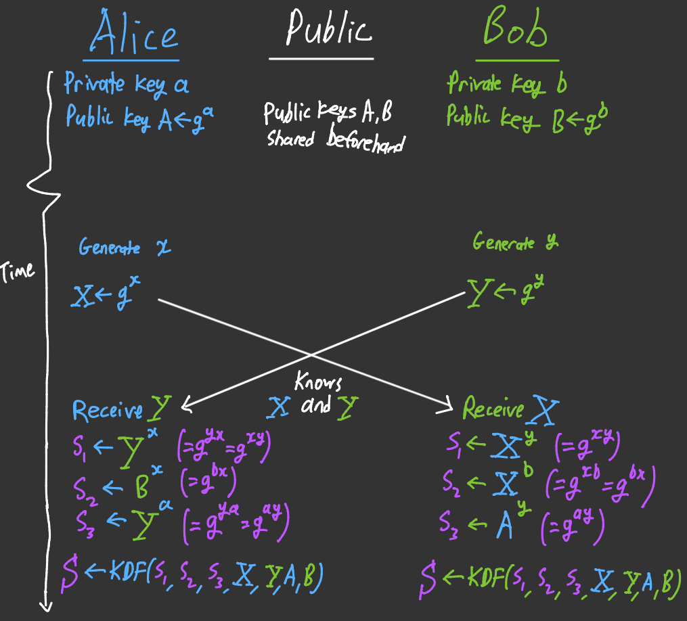
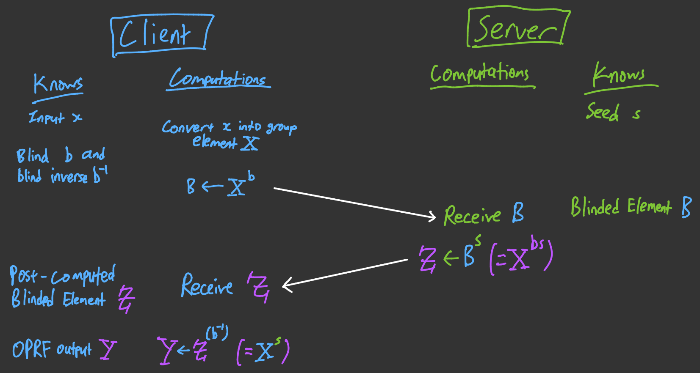
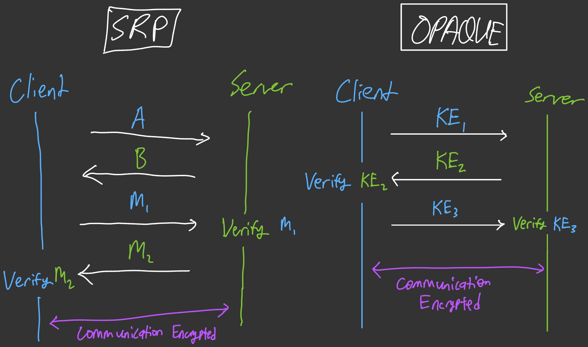

In a [previous blog post](/blog/2025-07-04/security-over-insecurity:-the-foundations-of-authenticated-key-exchange/), we took a look at several key exchange protocols, including the classic Diffie-Hellman Key Exchange protocol, the station-to-station protocol, and Secure Remote Password. These protocols are generally tried and tested across decades, but their age also means that improvements accrued across the decades are not included in these legacy protocols. Thus the need for a modern, Augmented Password-Authenticated Key Exchange (aPAKE) protocol was born. One of these state-of-the-art aPAKE protocols is OPAQUE, first introduced in 2018 and formally described in [Request for Comments (RFC) 9807](https://datatracker.ietf.org/doc/html/rfc9807) in 2025. In this post, we'll do a deep dive into how OPAQUE and its constituent parts work.

# A Look Back On Secure Remote Password (SRP)

Let's recap on what we are trying to do. Two friends, Alice and Bob, are talking to each other. Alice wants to send a message to Bob, but doesn't want anyone else from reading it. Thus they would need to have common key (a **symmetric key**) to encrypt/decrypt data with. Also, Alice would ideally want to verify that who she is talking to is _indeed_ Bob.

These two desiderata were achieved by the SRP protocol, which was first introduced in 1997. However, the latest version, SRP-6a (as defined in [RFC5054](https://www.rfc-editor.org/rfc/inline-errata/rfc5054.html) from 2007), is not perfect.

- **"Security Through Legacy"**: In short, we _assume_ that SRP is secure because we haven't found anything wrong with it. SRP was developed in a time before [Universal Composability](https://en.wikipedia.org/wiki/Universal_composability) became the norm, and so we haven't truly analysed it under adversarial network conditions.
- **Vulnerability to Server Compromise**: Recall in SRP that a verifier value $v = g^x \mod p$ is stored on the server. In effect, this verifier value _still_ acts as a sort-of hash; an attacker that has precomputed all possible values of $g^x \mod p$ can still recover the secret key $x$.
- **Flexibility**: SRP-6a is heavily tied to modular operations on integers and cannot harness modern developments such as elliptic curve technologies. In fact, if the discrete logarithm problem is solved by a quantum computer, all SRP-related protocols (including Diffie-Hellman) would be trivially broken and no longer secure.

What we want for a modern aPAKE protocol is to address all of these concerns &mdash; where the protocol's security has been rigorously examined and vetted, is resistant to attacks in case of a server compromise, and grants greater flexibility in its underlying operations in case a pivot to post-quantum cryptographic techniques is warranted.

# Triple Diffie-Hellman (3DH)

The first thing that needs to be replaced within SRP is the key exchange mechanism. As previously mentioned, the SRP key exchange mechanism is derived from the Diffie-Hellman Key Exchange (DHKE) protocol. The fundamental principle that DHKE relied on is the observation that

```math
(g^a)^b = g^{ab} = g^{ba} = (g^b)^a
```

for certain structures, called **groups**. Traditional DHKE uses the [multiplicative group of integers modulo $p$](https://en.wikipedia.org/wiki/Multiplicative_group_of_integers_modulo_n) as the underlying group, where $p$ is a prime, but the principle of DHKE extends beyond just numbers. All we need is a **cyclic group**, which is a group where all the elements are simply 'exponents'[^group-exponentiation] of (at least) one element $g$, called a **generator**. To put it more formally, for a cyclic group $G$, there is an element $g$ such that for any element in $G$, say $x$, we are able to find a corresponding integer $n$ such that $x = g^n$. Crucially, trying to reverse this process, i.e. to find $n$ given the group and $x$, is difficult. This is called the **discrete logarithm problem**[^discrete-log-hardness].

[^group-exponentiation]: To be a little clearer, 'exponentiation' by $n$ means that we apply the operation of a group $G$ on an element $n$ times. In the case of the multiplicative group of integers modulo $p$, that is the same as raising the power of an integer to $n$ before taking the remainder modulo $p$.

[^discrete-log-hardness]: It is actually not known _how_ difficult it is to recover $n$; we only have empirical experiments showing that it is hard.

Now let us recall how DHKE works. Suppose Alice and Bob wants to derive a shared key. They first agree, _publicly_, on a group to use and a generator $g$.

1. Alice randomly chooses a positive integer $a$. Bob does the same, choosing $b$.
2. Alice computes $A = g^a$ and sends it to Bob over the public channel. Bob computes $B = g^b$ and sends it to Alice.
3. Alice computes $s = B^a$ and Bob computes $s = A^b$.



Observe that both Alice and Bob derive the _same_ secret key $k$ at the end of the DHKE protocol. They can then use $s$ to encrypt messages between each other going forward. This is almost perfect, if not for the fact that a malicious actor (say, Mallory) could perform a **man-in-the-middle (MiTM)** attack and read the messages.



In this case, Mallory simply intercepts the key exchange messages of Alice and Bob and sets up two encrypted channels: one between Alice and Mallory and one from Mallory to Bob. To Alice and Bob, it would seem as though they are still communicating over an encrypted channel, but in reality their messages are being read by a third party.

There are several solutions to this problem, such as the Station-to-Station protocol described in the previous blog post. Here we will use another solution &mdash; triple Diffie-Hellman (3DH). It is almost the same as regular DHKE, except that we introduce public keys into the mix: Alice has a private key $a$ and a public key $A = g^a$, and Bob has a private key $b$ with public key $B = g^b$. Let's ignore _how_ Alice and Bob share their public keys with each other beforehand[^public-key-infrastructure]; how does 3DH work?

1. Alice and Bob chooses positive integers $x$ and $y$ respectively (known as the **secret keyshares**).
2. Alice computes $X=g^x$ and sends it to Bob over the public channel. Bob computes $Y = g^y$ and sends it to Alice. The values $X$ and $Y$ are called the **public keyshares**.
3. Alice and Bob compute the 'shared values':
    - The first shared value $s_1$ is akin to the DHKE shared value. Alice computes $Y^x$ and Bob computes $X^y$.
    - The second shared value $s_2$ checks if Bob can successfully prove that he is, indeed, Bob. While Alice computes $B^x$ using Bob's public key, Bob has to use his private key $b$ to compute $X^b$. That way $B^x = (g^b)^x = g^{bx} = (g^x)^b = X^b$.
    - The third shared value $s_3$ is similar to the second, but now it's Alice who needs to prove who she is. Alice computes $Y^a$ while Bob computes $A^y$; both sides are the same because $Y^a = (g^y)^a = g^{ay} = (g^a)^y = A^y$.
4. With the shared values obtained, a **Key Derivation Function (KDF)** is used to 'combine' $s_1$, $s_2$, and $s_3$ alongside all public values (i.e., $X$, $Y$, $A$, and $B$) into a single shared key[^types-of-kdf].

[^public-key-infrastructure]: A typical approach may be to rely on Public Key Infrastructure (PKI) with the use of Certificate Authorities (CAs). In OPAQUE, however, this question doesn't matter, as described later.

[^types-of-kdf]: There are many types of KDFs, each with different properties and uses. In this description of 3DH the KDF can just be thought of as combining these inputs into a single, fixed-length key. In OPAQUE, however, the KDF requirements are more stringent.



Let's walk through a simple demonstration of a 3DH key exchange in IPython. Here we use the multiplicative group of integers modulo 23 (i.e. $p = 23$) with the generator being $g = 5$. Note that a function call like `pow(a, b, m)` means $a^b \mod m$, i.e. raise $a$ to the power of $b$ modulo $m$.

<script src="https://asciinema.org/a/XEj9sYFNQZy13gdP.js" id="asciicast-XEj9sYFNQZy13gdP" async="true"></script>

In the end you can see that the `dh1`, `dh2`, and `dh3` values are the same for Alice (on the left) and Bob (on the right). Note that 3DH successfully prevents a MiTM attack since Mallory can't recover the private key of either Alice or Bob and impersonate them. In fact, 3DH is a **bilaterally authenticated key exchange mechanism**, allowing both sides to verify their identities and derive a common secret for encryption.

# ...Don't We Want Passwords?

Obviously, 3DH doesn't work with passwords. But what we want is a _Password_-Authenticated Key Exchange protocol! It's fine for the server to keep using a private/public key construction, but how do we get the client to generate the private and public keys for use in 3DH using passwords?

A fairly obvious approach would be just to take the user's password, pass it through a KDF[^salt-the-password] to generate the client's private (or secret) key $s$, and generate the public key $p = g^s$. We then send the public key to the server for use in 3DH. What's wrong with this? Well, since the client public key is (by definition) public, anyone can see what $p = g^s$ is. A malicious attacker could record down the value of $p$, precompute all possible public keys, and then seeing which password matches. This [rainbow table](https://en.wikipedia.org/wiki/Rainbow_table) attack means that anyone who obtains the public key of the client (which is _everyone_) could try and crack the client's password _without first breaching the server_.

[^salt-the-password]: This naive approach is _incredibly_ insecure. A [cryptographic salt](<https://en.wikipedia.org/wiki/Salt_(cryptography)>) is typically included as another input to the KDF to prevent trivial brute force attacks. In this hypothetical scenario, however, this doesn't matter.

What we want is to somehow make this key derivation process rely on a secret value that the server (and _only_ the server) has. But the server can't send this value to the client (as the channel is still not secured and thus could leak this secret value) and the client can't send its password to the server for processing (as that'll just be silly and leak the client's password). We need a way to protect the client's password, send it to the server for it to include its secret value, before sending it back for use in a KDF.

What could we use to do this?

# Oblivious Pseudorandom Functions (OPRFs)

Introducing OPRFs! These functions help us solve the problem of trying to mix in a server secret into the password-based key derivation process.

Before we look into the "oblivious" part of OPRFs, what _is_ a Pseudorandom Function (PRF)? Essentially, a PRF looks like a function that generates random outputs, except that the same input generates the same output. _Except_, it is also fed a secret key (or _seed_) so that the outputs of the PRF are the same for the same inputs.

To put it more precisely,

> A **Pseudorandom Function (PRF)** is a function $F$ taking a seed $s$ and input $x$ such that, for any $s$ chosen from a uniformly random distribution, the function $g(x) = F(s,x)$ is indistinguishable from a function sampling uniformly from the image of $F$.

In practice, encryption functions such as AES could be used as PRFs: just define $F(s,x) = \texttt{AES}_s(x)$ (where $s$ is the AES key) and you've got a PRF. However, that's _not_ how we are going to create an OPRF. For an OPRF, _the seed is held by one party_ (e.g. the server) while _the input is held by another_ (e.g., the client). So we can't use the AES trick to compute the OPRF output as that'll involve one party needing _both_ the seed and the input. We need to do something cleverer.

Assuming we are using cyclic groups, we can do something clever. Due to the Discrete Logarithm Problem, we know that finding $n$ given $g^n$ is hard. And assuming that we choose $n$ uniformly randomly, the $g^n$ would also be uniformly random. In addition, if we make the size of the cyclic group a prime, we can utilise the following interesting fact[^zp-is-a-field]:

> Let $\mathbb{Z}_p$ denote the set of integers $\{0, 1, 2, 3, \dots, p - 1\}$. Then for any $n \in \mathbb{Z}_p$ there is $k \in \mathbb{Z}_p$ such that $nk = 1 \mod p$. We may abuse notation and write $n^{-1} = k$.

[^zp-is-a-field]: This fact is due to $\mathbb{Z}_p$ being a field, in which all elements in it must have a multiplicative inverse. In the notation used in the aforementioned fact, the multiplicative inverse of $n$ is $k$.

This insight allows us to conceptually define an OPRF with seed $s$ and input $x$ as follows:

1. Convert $x$ into a group element $X$.
2. Randomly generate a positive integer $b$, called the **blind**.
3. Generate the **blinded element** $B = X^b$ and send it to the server.
4. On the server, assuming $s$ is an integer, compute $Z = B^s = (X^b)^s = X^{bs}$ and send it back to the client.
5. **Unblind** the blinded element by finding the multiplicative inverse of $b$, which is $b^{-1}$, and computing $Y = Z^{(b^{-1})} = X^{bs(b^{-1})} = X^s$ (remember that $b$ and $b^{-1}$ cancel out). This $Y$ can then be converted into a more 'suitable' form (e.g., by converting $Y$ into bytes) for further processing.



Let's see an OPRF in action. Let's use the [group of integers under addition modulo 23](https://en.wikipedia.org/wiki/Cyclic_group#Integer_and_modular_addition). In such a group the standard notation like $X^b$ means $b \times X$ (i.e., $X$ multiplied by $b$). Let's again use IPython for demonstration; note that

- the expression `randint(1, p-1)` means to generate a random integer from 1 to $p-1$ inclusive;
- an expression like `(b * x) % p` means $(b \times x) \mod p$; and
- the expression `pow(b, -1, p)` is to find $b^{-1} \mod p$, i.e. the multiplicative inverse of $b$ modulo $p$.

In the end you can see that the client's OPRF output is the same as someone who has both the OPRF input and seed.

<script src="https://asciinema.org/a/iUqkwnZgqINdmEGA.js" id="asciicast-iUqkwnZgqINdmEGA" async="true"></script>

Also observe that, throughout this process, the server never sees the input $x$ (or $X$) and the client never sees the seed $s$. Thus this is, in theory, an OPRF. In fact, this is largely how [RFC9497](https://datatracker.ietf.org/doc/html/rfc9497) defines the OPRF on cyclic groups with a prime size (like the group of integers under addition modulo 23). Of course, there are some nuances to make this an actual, standard worthy OPRF, which are covered in the aforementioned RFC.

# OPAQUE

Now that we understand how the 3DH key exchange mechanism works and how an OPRF could be used to include a server secret into a key derivation operation, we can finally take a look at the OPAQUE protocol. Essentially, it is an aPAKE that uses an OPRF, hence the name OPAQUE[^why-opaque].

[^why-opaque]: To quote RFC9807: "The name "OPAQUE" is a homonym of O-PAKE, where O is for Oblivious. The name "OPAKE" was taken."

Remember how 3DH _almost_ worked except for the part of generating client private/public keys? Now with an OPRF, we can solve this problem! The core idea is simple:

1. Client converts password into a key, say $x$, using a KDF.
2. Use the OPRF to incorporate the server's OPRF seed alongside $x$ to generate the new key $x'$.
3. Use $x'$ to generate the client's private key $s$ and public key $p = g^s$.
4. Perform 3DH key exchange, bilaterally authenticating each party.
5. Use derived shared key to encrypt communications.

This is _almost_ everything that is in OPAQUE, except that we still have to solve one problem: how does the client retrieve the server's public key? Remember, the throughout the entire process, the client and server are talking in an unsecure channel. That means that if the server sends the client its public key in the clear, a malicious actor could swap out that public key with their own. The solution is to use a **masking key** that allows the client and server to encrypt the response that includes the server public key. This masking key is based off the OPRF output and _needs to be sent to the server during registration_[^the-registration-problem]. Another thing that the server keeps is the client's public key, which was also sent along during registration.

[^the-registration-problem]: Like with every PAKE, the registration phase of the protocol is always assumed to be performed in some secure channel. So sending the masking key during the registration phase is okay, but sending it during the login phase is not.

Let's walk through how the OPAQUE login flow works in its entirety. Suppose our client is Carol and our server is Steve. They agree to use a cyclic group of prime size[^opaque-group] with generator $g$ and to use the 3DH key exchange mechanism. How does Carol log in?

[^opaque-group]: In RFC9807 they use an [Elliptic Curve Group](https://en.wikipedia.org/wiki/Elliptic_curve) such as [Ristretto255](https://datatracker.ietf.org/doc/html/rfc9496), which is a cyclic group of prime size. However introducing elliptic curves here would just muddy the explanation.

## Client Requests Login (Key Exchange Message 1)

Carol first passes her password into a special [**cryptographic hash function**](https://en.wikipedia.org/wiki/Cryptographic_hash_function) that converts her password into a group element, say $P$. We now generate the OPRF blind $b$ and then blind $P$, getting $B = P^b$ as our blinded element[^opaque-notation]. Then a [**cryptographic nonce**](https://en.wikipedia.org/wiki/Cryptographic_nonce) for Carol, $n_c$, as well as the 3DH keyshares $x$ and $X = g^x$ are generated. We'll see what $n_c$ is used for in a while, but for now it can be treated as a number that should _never_ be used more than once (i.e., it should not be repeated in another login attempt).

[^opaque-notation]: In RFC9807 the elliptic curve groups are [additive groups](https://en.wikipedia.org/wiki/Additive_group), meaning that the fundamental group operation is expressed as $g + h$ instead of $gh$, and consequently the 'exponentiation' of group elements is written as $ng$ instead of $g^n$ as we have been doing here. For consistency of notation within this blog post, however, we'll stick to using 'exponentiation'.

Carol sends the blinded password $B$, her nonce $n_c$, and her public keyshare $X$ to Steve in a structure called `KE1` (Key Exchange 1). Now Steve also needs to correctly retrieve Carol's public key $C$ and masking key from his own records, so Carol also needs to send her username to Steve alongside `KE1`.

## Server Responds (Key Exchange Message 2)

Steve receives Carol's `KE1` message and her username. He uses her username to retrieve her registration record, which includes Carol's public key $C$, masking key, and an envelope. This envelope contains a nonce $n_e$ and a [**Message Authentication Code (MAC)**](https://en.wikipedia.org/wiki/Message_authentication_code) (or **authentication tag**) $m_e$. What is this MAC used for? Well, it is to ensure that Carol's public key $C$, masking key, and the envelope itself has not changed during storage. Later, this MAC will also be used to check whether the client has the correct password, but more on that in a bit.

Like with Carol, Steve also generates a random cryptographic nonce $n_s$ alongside his 3DH keyshares $y$ and $Y = g^y$. Now Steve already has his own private key $s$ and public key $S = p^s$, so he can already complete the 3DH key exchange on his end. He computes $\texttt{dh}_1 = X^y$, $\texttt{dh}_2 = X^s$, and $\texttt{dh}_3 = C^y$, using them to generate the session key $K$ as well as two MACs: a server MAC $m_s'$ and an _expected_ client MAC $m_c$.

Now Carol still needs the output of the OPRF to complete her side of the key exchange! Steve has the OPRF seed, but has not applied it to the blinded password yet. He thus transforms that seed into a key using a KDF and then uses it to evaluate the blinded password $B$, obtaining $Z = B^{\texttt{OPRFkey}}$.

Steve is almost ready to send these values back to Carol, but he also needs to include his own public key $S$. But remember how that the channel is still insecure? Thus, Steve needs to use the masking key stored in the registration record of Carol _and_ a masking nonce $n_m$ to perform the encryption[^what-encryption] of $S$ _as well as_ the envelope. Providing the public key $S$ and the envelope to Carol allows her to check if (a) her password is correct and (b) whether Steve has the correct envelope (or if someone is pretending to be Steve).

[^what-encryption]: Although the word "encryption" might make it seem like this is a computationally expensive process, what is actually used is a [one-time pad](https://en.wikipedia.org/wiki/One-time_pad) based on Carol's masking key and the masking nonce. In particular, the masking key and masking nonce is expanded using a KDF to the length of the message, and then used to XOR the message.

So, at the end of all that, Steve bundles the evaluated blind $Z$, the masking nonce $n_m$, and the encrypted $S$ and envelope into a `CredentialResponse` structure, and packs the server nonce $n_s$, his public keyshare $Y$, and server MAC $m_s'$ into a `AuthResponse` structure. These two structures are sent to Carol as the `KE2` message.

## Client Proves Itself (Key Exchange Message 3)

Now, back to Carol. She receives the `KE2` message from Steve and unpacks it.

The first thing she does is to take the evaluated blind $Z$ and unblind it. As previously discussed, this is done by finding the multiplicative inverse of the blind $b$, say $b^{-1}$, and then computing $Z^{(b^{-1})}$ , since

```math
\begin{align*}
Z^{(b^{-1})} &= \left(B^{\texttt{OPRFkey}}\right)^{(b^{-1})}\\
&= B^{\texttt{OPRFkey} \times (b^{-1})}\\
&= \left(P^b\right)^{\texttt{OPRFkey} \times (b^{-1})}\\
&= P^{b \times \texttt{OPRFkey} \times (b^{-1})}\\
&= P^{\texttt{OPRFkey}}.
\end{align*}
```

The OPRF output, $P^{\texttt{OPRFkey}}$, is used as input to a KDF to generate a **random password**. This random password is the aforementioned output of the OPRF that was used to create the masking key, which Carol can now obtain. So she can use that key to recover Steve's public key $S$ as well as the envelope. Typically now Carol would check if $S$ along with the envelope produces the same envelope MAC $m_e$ as what was found in the envelope itself. If not, it might be the case that Carol got her password wrong.

Assuming it is correct, this random password is also used to (re)generate the client private key $c$ and client public key $C = g^c$. She can now complete the 3DH key exchange on her end by computing $\texttt{dh}_1 = Y^x$, $\texttt{dh}_2 = S^x$, and $\texttt{dh}_3 = Y^c$, using them to generate the session key $K$, the _expected_ server MAC $m_s$, and the client MAC $m_c'$. Carol checks Steve's server MAC $m_s'$ against her own $m_s$ and verifies that they are the same. If it is, she sends Steve her client MAC $m_c'$ as the `KE3` message.

At this point, Carol has completed authenticating Steve and is ready to begin encrypted communications using the session key $K$. However, Steve still needs to do one more thing.

## Server Finalizes

Steve receives Carol's client MAC $m_c'$ and compares it with his expected MAC $m_c$. If they do not match, he drops the connection. Otherwise, he would have verified Carol's identity and can begin encrypted communications using the session key $K$.

Phew! That was a lot. As you can see, the OPAQUE protocol is quite dense. But understanding the two main aspects of OPAQUE, namely the key exchange mechanism and the inclusion of server secrets into the password-based key derivation process, it becomes more manageable and understandable as a whole.

# OPAQUE's Modularity and Post-Quantum Cryptography

An obvious surface-level improvement of OPAQUE is that it takes less **round trips** than SRP, as seen in the diagram below.



Another improvement that OPAQUE has over SRP is that it is very modular. OPAQUE is made up of two main components: the key exchange mechanism and the OPRF. In RFC9807 they specified 3DH as the key exchange mechanism and the cyclic group-based OPRF as the OPRF implementation. But these can be swapped out for others!

An exciting opportunity is to implement a **post-quantum secure** OPAQUE protocol by swapping out the key exchange mechanism and the OPRF with ones that are post-quantum secure. So far, the National Institute of Standards and Technology (NIST) has [standardized several post-quantum cryptographic protocols](https://csrc.nist.gov/projects/post-quantum-cryptography), including a module lattice-based key encapsulation mechanism in [FIPS203](https://csrc.nist.gov/pubs/fips/203/final) which, when paired with the corresponding digital signature algorithm in [FIPS204](https://csrc.nist.gov/pubs/fips/204/final), could replace 3DH as a post-quantum secure key exchange mechanism. A post-quantum secure OPRF remains elusive, though. But the modularity of OPAQUE means that, when a post-quantum OPRF become provably secure, they can be swapped with the existing OPRF to make a fully post-quantum secure aPAKE protocol built upon OPAQUE.

# Image Credits

Photo by [Compare Fibre](https://unsplash.com/@comparefibre?utm_source=unsplash&utm_medium=referral&utm_content=creditCopyText) on [Unsplash](https://unsplash.com/photos/black-flat-screen-computer-monitor-tiSE_paTt0A). Resized from the original.
