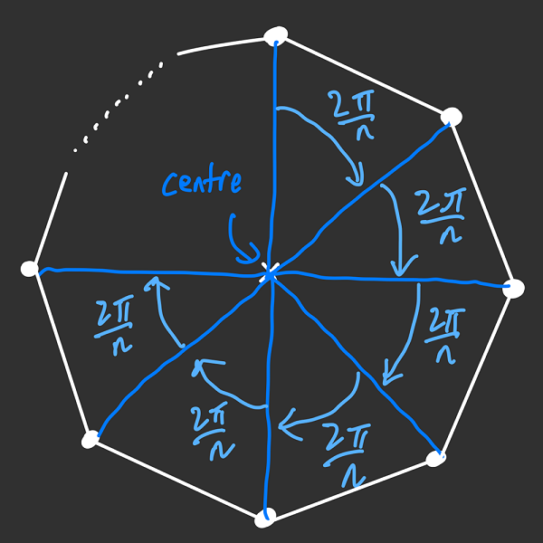
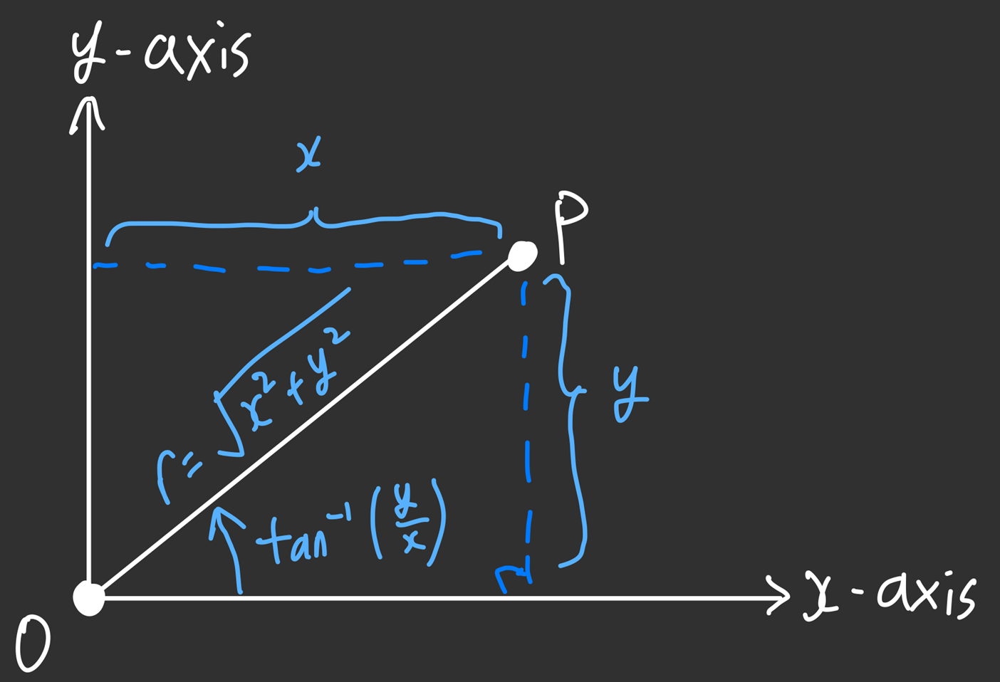

This question popped up in my mind one fine day, and I couldn't stop thinking about it. So here's a blog post about it.

# The Problem

> Find all $n \geq 3$ such that $n$ points can be chosen in a 2D integer lattice to form a regular $n$-gon.

Okay, let us unpack what this is asking.

- A _lattice_ refers to the subset of points in $\mathbb{R}^d$ where the coordinates are integer values[^lattice-general]. In particular, a 2D integer lattice is the subset of points $(x,y)$ in $\mathbb{R}^2$ such that $x$ and $y$ are both integers.
- A _regular $n$-gon_ refers to a polygon of $n$ sides (e.g., triangle, rectangle, pentagon) whose sides are of equal length and all internal angles are of equal measure. Common examples of regular $n$-gons are equilateral triangles and squares.

[^lattice-general]: A _lattice_ in general refers to a subset of $\mathbb{R}^d$ with the following properties: (a) component-wise addition/subtraction of two lattice points still results in a lattice point; (b) there is a minimum distance between any two lattice points; and (c) there is a maximum distance for which any point in $\mathbb{R}^d$ is within that maximum distance from a lattice point. Read more [in this Wikipedia article](<https://en.m.wikipedia.org/wiki/Lattice_(group)>).

So we are asking for all values of $n \geq 3$ such that the points $(x_1,y_1)$, $(x_2,y_2)$, ..., $(x_n, y_n)$ form a regular $n$-gon, where each of the coordinates are integers.

There is an obvious value of $n$ for which this applies: $n = 4$, the case for which our polygon is a square. There are in fact an infinite number of squares that meet our requirement above. But the challenge is to find other values of $n$ that work (if they exist).

Another subtle challenge is that there are multiple orientations to consider when drawing the polygons. Just because a polygon doesn't work for one orientation doesn't mean that we can't find any if the shape is rotated.

# A Transformation

To deal with these challenges at the same time, let us consider how the points are located for a regular $n$-gon.

As discussed above, an $n$-gon consists of $n$ sides of equal length and $n$ internal angles which are of equal measure. But consider what this means for the vertices of the $n$-gon — because the $n$ internal angles are of equal measure, that means that the angle between each of the $n$ points must be the same. Since there are $2\pi$ radians ($360^\circ$ degrees) in a full revolution, thus each angle between the points must be $\frac{2\pi}{n}$ radians.



Now let us think about how we can 'move' from one point to another on an $n$-gon. More generally, how do we rotate a point in the 2D plane by $\alpha$ radians about the centre (i.e., origin)? We will use the idea of _polar coordinates_ to help us with this. Instead of writing the coordinates of a point using $x$ and $y$, we will specify the **distance from the origin**, typically denoted $r$ (for the radius of the circle that the point lies on) and the **angle between the _positive_ $x$-axis and the point**, typically denoted $\theta$.

Suppose a point has the coordinates $(x,y)$. By the Pythagorean theorem, the distance from the origin is $r=\sqrt{x^2+y^2}$. Using trigonometry, one also sees that the angle made between the positive $x$-axis and the point is $\theta=\tan^{-1}\left(\frac yx\right)$[^polar-coordinate-angle]. To convert polar coordinates back to Cartesian coordinates, one can simply use the formulae $x = r\cos\theta$ and $y=r\sin\theta$.



[^polar-coordinate-angle]: This is not actually true in general; it depends on which quadrant the point lies. In particular, if we let $\varphi = \tan^{-1}\left(\frac yx\right)$, then the angle is $\varphi$ for the first quadrant, $\varphi + \pi$ for the second quadrant, $\varphi - \pi$ for the third quadrant, and $\varphi + 2\pi$ for the fourth quadrant. But this also ignores the cases where $x = 0$. In general the angle $\theta$ is best described using the $\mathrm{atan2}$ function which encompasses the messiness of this computation.

So what happens when we rotate a point by an angle $\alpha$ about the origin? The point is still a distance $r$ from the origin, but the angle between the positive $x$-axis and the point is now $\theta+\alpha$. In Cartesian coordinates, the point will have the new coordinates $x' = r\cos(\theta+\alpha)$ and $y' = r\sin(\theta+\alpha)$. Using the [angle addition formulae for sine and cosine](https://en.wikipedia.org/wiki/List_of_trigonometric_identities#Angle_sum_and_difference_identities), we see that

```math
\begin{align*}
x' &= r\cos(\theta+\alpha) = r\left(\cos\theta\cos\alpha - \sin\theta\sin\alpha\right) = x\cos\alpha - y\sin\alpha\\
y' &= r\sin(\theta+\alpha) = r\left(\sin\theta\cos\alpha + \cos\theta\sin\alpha\right) = x\sin\alpha + y\cos\alpha
\end{align*}
```

So, rotating a point $P(x,y)$ about the origin by $\alpha$ will result in the point $P'$ with coordinates $(x\cos\alpha - y\sin\alpha, x\sin\alpha + y\cos\alpha)$[^angle-transformation].

[^angle-transformation]: Those familiar with linear algebra would recognise this transformation as the transformation by a [rotation matrix](https://en.wikipedia.org/wiki/Rotation_matrix) $\mathbf{R} = \begin{pmatrix}\cos\alpha&-\sin\alpha\\\sin\alpha&\cos\alpha\end{pmatrix}$ on the vector $\mathbf{v} = \begin{pmatrix}x\\y\end{pmatrix}$. That is, the resulting point is given by the vector $\mathbf{Rv}$.

Back in our original problem, to 'move' from one point to another means to rotate that point by a multiple of $\frac{2\pi}n$. So, starting from a point $(x,y)$ on the regular $n$-gon, another point on that $n$-gon **must** be $\left(x\cos\left(\frac{2k\pi}n\right) - y\sin\left(\frac{2k\pi}n\right), x\sin\left(\frac{2k\pi}n\right) + y\cos\left(\frac{2k\pi}n\right)\right)$ where $k \in \{1,2,\dots,n-1\}$.

As we will soon see, this will lead to a problem if we want all points to have integer coordinates.

# Rational Values of Sine and Cosine

The challenge lies in making sine and cosine rational. Before we reveal what the core result is, let us examine a lemma.

> **Lemma**. There exists a polynomial $F_n(x)$ such that
>
> ```math
> F_n(2\cos t) = 2\cos nt
> ```
>
> for all $n \geq 1$, where the degree of $F_n(x)$ is $n$ and $F_n(x)$ is a monic polynomial (i.e., the leading coefficient is 1) with integer coefficients.

This claim is readily proven using mathematical induction on $n$.
Let us first cover two base cases. For $n=1$, note that the polynomial $F_1(x) = x$ clearly works. For $n = 2$, we note that the polynomial $F_2(x) = x^2 - 2$ works because

```math
\begin{align*}
(2\cos t)^2 - 2 &= 4\cos^2 t - 2\\
&= 4\left(\frac12 (\cos2t + 1)\right) - 2\\
&= (2\cos2t + 2) - 2\\
&= 2\cos2t
\end{align*}
```

Now let’s assume that the lemma holds for $k$ and $k + 1$ for some $k \geq 1$. We will show that the lemma holds for the $k+2$ case. Observe that, by the sum of cosines formula, we get

```math
2(\cos((k+1)t))(\cos t) = \cos((k+2)t)+\cos kt
```

which means

```math
\cos((k+2)t) = 2(\cos((k+1)t))(\cos t) - \cos kt
```

and therefore

```math
2\cos((k+2)t) = (2\cos((k+1)t))(2\cos t) - 2\cos kt.
```

Hence,

```math
F_{k+2}(x) = xF_{k+1}(x) - F_k(x)
```

works, with $F_{k+2}(x)$ having degree $k+2$. Also, the leading coefficient of $F_{k+2}(x)$ is the same as the leading coefficient of $F_{k+1}(x)$, which is, by assumption, 1. Therefore, by induction, the lemma is proven. ∎

With this lemma we can prove the main result.

> **Theorem**. The only values of $\theta$, where $0 \leq \theta \leq \frac\pi2$, such that both $\frac\theta\pi$ and $\cos\theta$ are rational are $\theta = 0$ (and $\cos\theta = 1$), $\theta = \frac\pi3$ (and $\cos\theta = \frac12$), and $\theta = \frac\pi2$ (and $\cos\theta = 0$).

This result is quite surprising, but the proof is not too complicated. Suppose $\frac\theta\pi$ is rational, so we can write $\theta = \frac{2\pi k}{n}$ where $k$ and $n$ are both integers[^denom-is-even] with $n \geq 1$. Suppose $c = 2\cos\theta$ is rational. By the lemma, we observe that

```math
F_n(c) = F_n\left(2\cos\frac{2\pi k}{n}\right) = 2\cos2\pi k = 2
```

which means that $c$ is a root of $F_n(x) - 2$. Since $c$ is rational, and $F_n(x) - 2$ is a monic polynomial with integer coefficients, thus the [Rational Root Theorem](https://en.wikipedia.org/wiki/Rational_root_theorem) tells us that $c$ must be an integer.

[^denom-is-even]: In fact, in this representation, $n$ is an even number.

However, note that $|c| = |2\cos\theta| \leq 2$ since $-1 \leq \cos \theta \leq 1$. Therefore, the only possible values that $c$ can take are -2, -1, 0, 1, and 2. Thus one must conclude that $\cos \theta \in \{-1,-\frac12,0,\frac12,1\}$. Given that $\theta$ is between $0$ and $\frac\pi2$ inclusive, this means that $\cos\theta \in \{0, \frac12, 1\}$ with $\theta \in \{0, \frac\pi3, \frac\pi2\}$. ∎

One might deduce the following corollary from the above theorem, often called **Niven's Theorem**[^niven-theorem].

> **Corollary**. The only values of $\theta$, where $0 \leq \theta \leq \frac\pi2$, such that both $\frac\theta\pi$ and $\sin\theta$ are rational are $\theta = 0$ (and $\sin\theta = 0$), $\theta = \frac\pi6$ (and $\sin\theta = \frac12$), and $\theta = \frac\pi2$ (and $\sin\theta = 1$).

[^niven-theorem]: Although we presented it as a corollary, this is the actual statement of Niven's theorem.

The proof is quite simple. Let $\alpha = \frac\pi2 - \theta$, so $0 \leq \alpha \leq \frac\pi2$. By the theorem above we know that $\cos(\alpha) = \cos\left(\frac\pi2 - \theta\right) = \sin\theta$ is rational only when $\alpha = 0$ (which means $\theta = \frac\pi2$), $\alpha = \frac\pi3$ (which means $\theta=\frac\pi6$), or $\alpha=\frac\pi2$ (which means $\theta=0$). Consequently the values of $\sin\theta$ that are rational are $0$, $\frac12$, and $1$. ∎

# Consequences

Returning to our problem, what does this theorem tell us? Recall that if a point $(x,y)$ lies on the $n$-gon, then $\left(x\cos\left(\frac{2k\pi}n\right) - y\sin\left(\frac{2k\pi}n\right), x\sin\left(\frac{2k\pi}n\right) + y\cos\left(\frac{2k\pi}n\right)\right)$ is another point on the $n$-gon. We also want all the points on the $n$-gon to be integers, which means that both $x\cos\left(\frac{2k\pi}n\right) - y\sin\left(\frac{2k\pi}n\right)$ and $x\sin\left(\frac{2k\pi}n\right) + y\cos\left(\frac{2k\pi}n\right)$ need to be integers. Let us just focus on $x\sin\left(\frac{2k\pi}n\right) + y\cos\left(\frac{2k\pi}n\right)$. We know two things.

- By the above theorem, $\cos\left(\frac{2k\pi}n\right)$ can only be rational when $\frac{2k\pi}n = 0$ (which is impossible since $k \geq 1$), $\frac{2k\pi}n = \frac\pi3$, or $\frac{2k\pi}n = \frac\pi2$.
- By the above corollary (Niven's Theorem), $\sin\left(\frac{2k\pi}n\right)$ can only be rational when $\frac{2k\pi}n = 0$ (again, impossible since $k \geq 1$), $\frac{2k\pi}n = \frac\pi6$, or $\frac{2k\pi}n = \frac\pi2$.

Thus, for $x\sin\left(\frac{2k\pi}n\right) + y\cos\left(\frac{2k\pi}n\right)$ to be rational, we must have $\frac{2k\pi}n = \frac\pi2$. Regardless of the value of $n$, we need consecutive points on the $n$-gon to work, i.e. the case of $k = 1$ needs to work. For that case we have $\frac{2\pi}n = \frac\pi2$ which means that $n = 4$, i.e. a square.

In conclusion: the _only_ $n$ (where $n \geq 3$) such that $n$ points can be chosen in a 2D integer lattice to form a regular $n$-gon is $n = 4$, which is the (boring) case of the square.

# Image Credits

Cover image by [D koi](https://unsplash.com/@dkoi?utm_content=creditCopyText&utm_medium=referral&utm_source=unsplash) on [Unsplash](https://unsplash.com/photos/a-white-antenna-with-many-small-balls-COFXWa6LJdw?utm_content=creditCopyText&utm_medium=referral&utm_source=unsplash). Cropped from the original.
